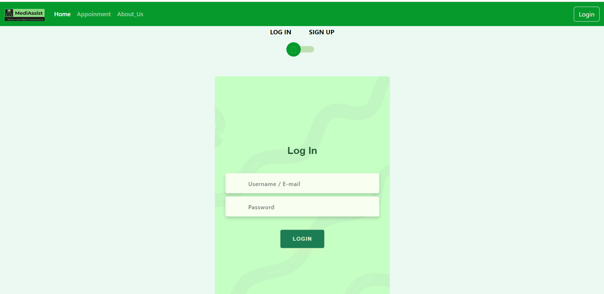
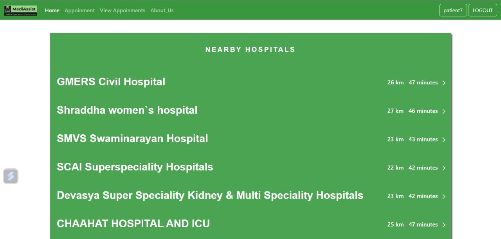

# 🩺 Hospital Management System 🩺

## 

## Table of Contents 🚀
* [Introduction](#introduction)
* [Privileges](#privileges)
* [Technologies](#technologies)
* [Demo](#demo)
* [Team](#team)

## ⭐ Introduction
This Hospital Management System helps patients, doctors, hospitals, ambulances, and government agencies by making healthcare work better. It makes things like appointments and information easier, so patients get better care. It also helps with keeping track of data in healthcare. The goal is to solve problems for everyone involved and make healthcare services better overall.

## ⭐ Privileges
- **For Patients**
  - Access information about hospitals, including specialties, services, and location.
  - Book appointments with doctors at preferred hospitals.
  - Access pharmacy and laboratory information.
  - View prescription history and medical bills.
  - Monitor appointments and receive reminders.
  - View and update personal health information.
- **For Doctors**
  - Access patient information and medical history.
  - Schedule patient appointments.
  - Generate prescriptions and bills.
  - Track patient progress, diets, and lab reports.
  - Maintain a schedule of appointments.
  - View hospital information and resources.
- **For Hospitals**
  - Register and provide basic information.
  - Specify medical specialties and services.
  - Manage ICU availability and bed occupancy.
  - List available doctors and staff.
  - Offer medical insurance details.
  - Monitor and manage appointments and patient data.
  - Receive appointment notifications.
  - Access ambulance service requests and notifications.
- **For Ambulance Services**
  - Locate and navigate to the nearest hospitals.
  - Access hospital data including bed availability and staff information.
  - Notify hospitals in case of emergencies.
- **For Government Agencies**
  - Access a personalized database for monitoring hospitals, doctors, and patient’s restricted data.
  - Monitor healthcare infrastructure, services, and resources.
  - Utilize data for policy -making and resource allocation.
## ⭐ Technologies
HTML
 
  
 
CSS
 

 
JavaScript
 

 
PostgreSQL
 

 
NodeJs
 

 
ExpressJs
 

 
PassportJs
 

 
EJS
 

## ⭐ Demo
You can visit our website using this link
https://tasty angelfish.cyclic.app/

### Features
   **Login**
  

   **Sign Up**
  

   **Home Page**
  

   **Facilities**
 
  

### Specific Facilities for Users

   🟢 **Patient 🙎‍♂**
    
     Patients can search for nearby hospitals
    
     Patients use this to monitor and manage their appointments.
    

   🟢 **Doctor 👨‍⚕**
    
     Doctors can see both past and upcoming events.
    
    

   🟢**Hospital 🏥**
    
     View all scheduled appointments.
    
     Access information about all doctors and add new doctors to its roster.
    
     Monitor and manage the admissions of patients within the hospital.
    
     Add pharmacies to its services.
    
     Integrate laboratories as part of its facilities.
    

   🟢 **Ambulance Driver 🚑**
    
     An ambulance driver can utilize this system to transport a patient to the nearest hospital, taking into consideration bed availability and the specialized expertise of the attending doctor.
    
     Ambulance driver can find out nearby hospitals with traffic time considered
  

   🟢**Government Agency 🏬**
    
     A government agency can access hospital and doctor data through this platform, facilitating informed decision making.
    

   🟢 **Pharmacy 💊**
    
     It is not initially included as part of the primary user profile but can be registered by the hospital.
     It can update the stock of medicines.
    
     pharmacy can manage their inventory by adding or updating medicine stocks
  

## ⭐ Team
1. Aaditya Patel
2. Aakshat Kadiya
3. Dharmesh Kota
4. Krishil Jayswal
5. Krushi Sutariya

😊💕Trust us with your health, and we promise we won't break your heart.💕😊

Thank you.....🌟💫
